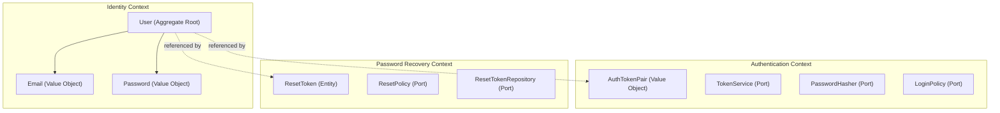
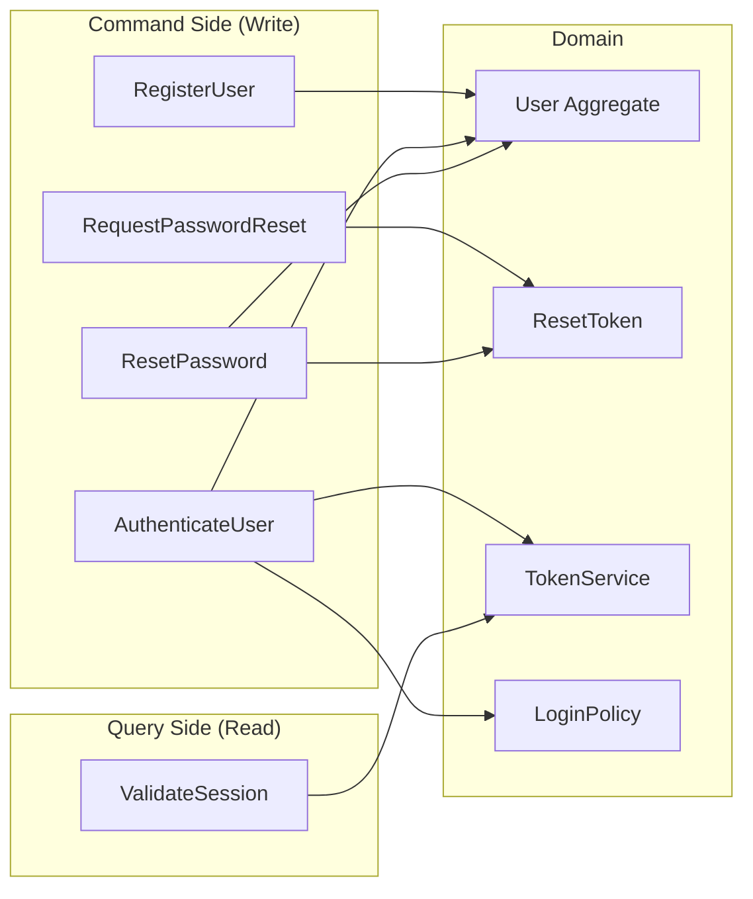

# Auth Module

Модуль аутентификации пользователей.

## Поддерживаемые сценарии

1. **Регистрация** — создание нового аккаунта с валидацией почты и пароля
2. **Авторизация** — вход по email/пароль с выдачей JWT-токенов (access + refresh)
3. **Восстановление пароля** — запрос reset-токена + смена пароля

## Быстрый старт

### Предварительные требования

- Node.js 20+
- Docker и Docker Compose (для полного стенда)

### Запуск тестов (с запущенным Docker сервисом)

```bash
npm install
npm test
```

### Запуск полного стенда

```bash
cd infra
docker compose up --build
```

Это поднимет:
- **PostgreSQL** на порту `5432`
- **Auth gRPC Service** на порту `50051` (gRPC) и `9090` (метрики/health)
- **Prometheus** на порту `9091`

## Выбор стека и аргументация

**TypeScript**: Строгая типизация, простое тестирование через моки, большой выбор библиотек, быстрый старт. Альтернативы:
Go (меньше выразительности для DDD), Rust (тяжело быстро собрать прототип, сложнее тестирование)

**gRPC**: Строго типизированный контракт (proto), эффективная сериализация. Альтернативы: REST (менее строгий контракт, не рекомендован в ТЗ), GraphQL (не нужен для авторизации)

**argon2**: Современная крипто библиотека. Альтернатвы: bcrypt (устаревший, но надёжный), scrypt

**jose**: Современная JWT-библиотека, поддержка ESM. Альтернативы: jsonwebtoken (legacy, не ESM), paseto (менее распространён)

**PostgreSQL**: Надёжное хранилище, подходит для аутентификации. Альтернативы: MongoDB (документная модель не очень подходит), SQLite (не для прода), MySQL (неплохой вариант, но сложнее масштабировать)

**Pino**: Популярный логгер

**testcontainers**: Тесты с реальной БД, нет расхождения между тестами и продом. Альтернативы: In-memory (скрывают SQL-ошибки), SQLite (другой диалект)

**prom-client**: Популярный Prometheus клиент

## Архитектура

### Доменная модель и границы контекстов



### CQRS — Command и Query Side



**Command handlers**:
- `RegisterUserHandler` — валидация, хеширование, создание User aggregate
- `AuthenticateUserHandler` — проверка логина/пароля, IP-based rate limiting, выдача токенов
- `RequestPasswordResetHandler` — генерация reset token, rate limiting
- `ResetPasswordHandler` — валидация токена, смена пароля

**Query handlers**:
- `ValidateSessionHandler` — проверка access token

### Слои архитектуры

```
src/
├── domain/                      # Чистый домен (нет зависимостей от инфраструктуры)
│   ├── identity/                # Bounded Context: Identity
│   │   ├── model/               # User aggregate, Email/Password value objects
│   │   ├── repository/          # Port: UserRepository interface
│   │   └── events/              # Domain events: UserRegistered
│   ├── authentication/          # Bounded Context: Authentication
│   │   ├── model/               # AuthTokenPair value object
│   │   ├── service/             # Ports: TokenService, PasswordHasher, LoginPolicy
│   │   └── events/              # Domain events: UserAuthenticated
│   └── password-recovery/       # Bounded Context: Password Recovery
│       ├── model/               # ResetToken entity
│       ├── repository/          # Port: ResetTokenRepository
│       └── service/             # Port: ResetPolicy
├── application/                 # Application layer
│   ├── commands/                # Command handlers (write side)
│   └── queries/                 # Query handlers (read side)
├── infrastructure/              # Adapters
│   ├── crypto/                  # Argon2PasswordHasher, JwtTokenProvider
│   ├── persistence/             # PostgreSQL repositories
│   ├── grpc/                    # gRPC server
│   ├── observability/           # Pino logger, Prometheus metrics
│   └── rate-limiting/           # InMemoryRateLimiter, InMemoryLoginPolicy
```

## Ключевые инварианты и бизнес-правила

### Пароль
- Минимум 8 символов
- Обязательно: uppercase, lowercase, цифра, спецсимвол
- Хранится только хеш

### User Aggregate
- Email уникален
- Статусы: `ACTIVE` -> `LOCKED`
- Блокировка по IP: при превышении лимита попыток (10 за 15 мин) IP блокируется
- IP-based rate limiting предотвращает блокировку легитимных пользователей злоумышленниками

### Reset Token
- Криптографически безопасный (32 байта)
- TTL: 1 час
- Однократное использование
- При новом запросе — все старые токены пользователя инвалидируются

### Rate Limiting
- Login: максимум 10 попыток за 15 минут, кулдаун 1 сек
- Register: максимум 5 за час, кулдаун 5 сек
- Password Reset: максимум 3 запроса за час, кулдаун 60 сек

### Предотвращение email enumeration
- Запрос на восстановление пароля для несуществующей почты возвращает тот же ответ, что и для существующей

### JWT
- Access token: 15 мин TTL, подписан отдельным секретом
- Refresh token: 7 дней TTL, подписан отдельным секретом
- Тип токена (`access`/`refresh`) закодирован в payload — нельзя использовать refresh вместо access

## gRPC API

Определение в `proto/auth.proto`


## Наблюдаемость

- **Метрики**: Prometheus (`/metrics` на порту 9090)
  - `auth_registration_total` — счётчик регистраций
  - `auth_login_total` — счётчик логинов
  - `auth_password_reset_request_total` — счётчик запросов на сброс
  - `auth_grpc_request_duration_seconds` — latency histogram
- **Health check**: `/health` на порту 9090

## Тесты

```bash
# Все тесты
npm test

# Только доменные тесты
npm run test:domain

# Только application-тесты
npm run test:application

# Только интеграционные
npm run test:integration
```

## Domain Events

Система генерирует доменные события:
- `UserRegistered` — при успешной регистрации
- `UserAuthenticated` — при успешном входе
- `AuthenticationFailed` — при неудачной попытке
- `PasswordResetRequested` — при запросе сброса
- `PasswordResetCompleted` — при успешном сбросе

В текущей реализации события хранятся в памяти. В проде можно подключить очередь событий (RabbitMQ/Kafka) для реакции на события (отправка почты, аудит).

## Ключевые компромиссы

1. In-memory rate limiter
2. Testcontainers для тестов
3. JWT без блеклистинга
4. Нет долгосрочной блокировки пользователей

## Следующие шаги для будущей версии

1. **Linter, Formatter, Typecheck** - проверка кода и стандартное форматирование
2. **Email-сервис** — отправка reset-ссылок по почте
3. **CI/CD** — автоматические тесты, сканирование уязвимостей, деплой
4. **Redis rate limiter** — рейт лимит с помощью Redis для поддержки масштабирования
5. **Token blacklist** — поддержка logout пользователя
6. **Refresh token rotation** — ротация refresh токена при каждом использовании
7. **Account recovery** — дополнительные методы верификации (SMS, TOTP)
