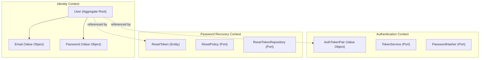
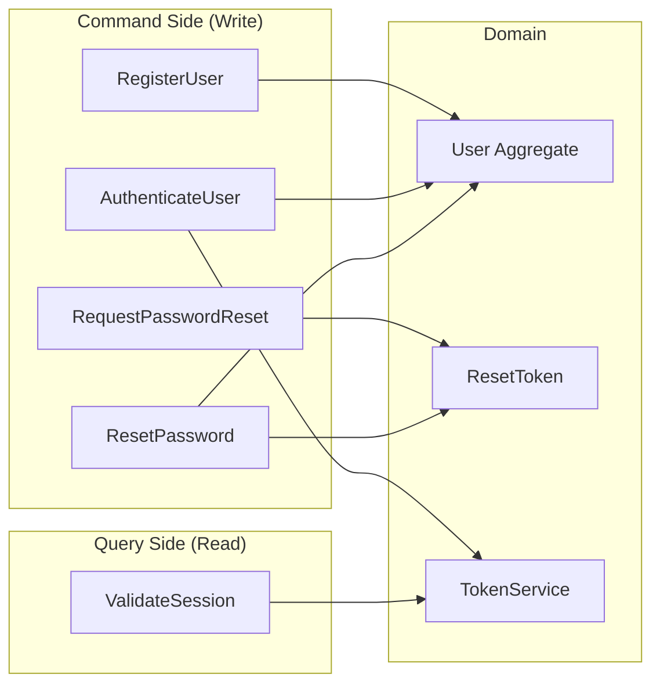

# Auth Module — DDD + CQRS + gRPC

Модуль аутентификации, реализованный на TypeScript с применением Domain-Driven Design, CQRS и gRPC.

## Поддерживаемые сценарии

1. **Регистрация** — создание нового аккаунта с валидацией email и пароля
2. **Авторизация** — вход по email/пароль с выдачей JWT-токенов (access + refresh)
3. **Восстановление пароля** — запрос reset-токена + смена пароля

## Быстрый старт

### Предварительные требования

- Node.js 20+
- Docker и Docker Compose (для полного стенда)

### Запуск тестов (без инфраструктуры)

```bash
npm install
npm test
```

### Запуск полного стенда (Docker Compose)

```bash
cd infra
docker compose up --build
```

Это поднимет:
- **PostgreSQL** на порту `5432`
- **Auth gRPC Service** на порту `50051` (gRPC) и `9090` (метрики/health)
- **Prometheus** на порту `9091`

### Запуск через Terraform

```bash
cd infra/terraform
terraform init
terraform apply
```

### Kubernetes

```bash
kubectl apply -f infra/k8s/auth-module.yaml
```

## Выбор стека и аргументация

| Решение | Почему | Альтернативы |
|---------|--------|-------------|
| **TypeScript** | Строгая типизация, явные интерфейсы для domain ports, широкая экосистема | Go (меньше выразительности для DDD), Rust (overhead для прототипа) |
| **gRPC** | Строго типизированный контракт (proto), эффективная сериализация, code generation | REST (менее строгий контракт), GraphQL (overkill для auth) |
| **argon2** | Argon2id — победитель Password Hashing Competition, устойчив к GPU и side-channel атакам | bcrypt (устаревший, но надёжный), scrypt |
| **jose** | Современная JWT-библиотека, ESM-native, использует Web Crypto API, нет устаревших зависимостей | jsonwebtoken (legacy, не ESM), paseto (менее распространён) |
| **PostgreSQL** | Надёжное ACID-хранилище, подходит для identity data | MongoDB (нет нужды в document model), SQLite (не для prod) |
| **Pino** | Быстрый structured logging, JSON-формат для агрегации | Winston (медленнее), Bunyan (устаревший) |
| **testcontainers** | Тесты с реальной БД, нет расхождения между тестами и production | In-memory mocks (скрывают SQL-ошибки), SQLite (другой диалект) |
| **prom-client** | Prometheus-native метрики, де-факто стандарт для K8s | StatsD, OpenTelemetry (более тяжёлый) |

## Архитектура

### Доменная модель и границы контекстов



### CQRS — Command и Query Side



**Command handlers** (write side):
- `RegisterUserHandler` — валидация, хеширование, создание User aggregate
- `AuthenticateUserHandler` — проверка credentials, выдача токенов, учёт failed attempts
- `RequestPasswordResetHandler` — генерация reset token, rate limiting, предотвращение email enumeration
- `ResetPasswordHandler` — валидация токена, смена пароля

**Query handlers** (read side):
- `ValidateSessionHandler` — проверка JWT access token

### Слои архитектуры

```
src/
├── domain/                      # Чистый домен (нет зависимостей от инфраструктуры)
│   ├── identity/                # Bounded Context: Identity
│   │   ├── model/               # User aggregate, Email/Password value objects
│   │   ├── repository/          # Port: UserRepository interface
│   │   └── events/              # Domain events: UserRegistered, UserLocked
│   ├── authentication/          # Bounded Context: Authentication
│   │   ├── model/               # AuthTokenPair value object
│   │   ├── service/             # Ports: TokenService, PasswordHasher
│   │   └── events/              # Domain events: UserAuthenticated
│   └── password-recovery/       # Bounded Context: Password Recovery
│       ├── model/               # ResetToken entity
│       ├── repository/          # Port: ResetTokenRepository
│       └── service/             # Port: ResetPolicy
├── application/                 # Application layer (CQRS handlers)
│   ├── commands/                # Command handlers (write side)
│   └── queries/                 # Query handlers (read side)
├── infrastructure/              # Adapters (implementations of ports)
│   ├── crypto/                  # Argon2PasswordHasher, JwtTokenProvider (jose)
│   ├── persistence/             # PostgreSQL repositories
│   ├── grpc/                    # gRPC server (transport adapter)
│   ├── observability/           # Pino logger, Prometheus metrics
│   └── rate-limiting/           # InMemoryRateLimiter
```

## Ключевые инварианты и бизнес-правила

### Пароль
- Минимум 8 символов
- Обязательно: uppercase, lowercase, цифра, спецсимвол
- Хранится **только** Argon2id-хеш (memory-hard, защита от GPU-атак)

### User Aggregate
- Email уникален (проверка на уровне repository)
- Статусы: `PENDING` → `ACTIVE` → `LOCKED`
- После 5 неудачных попыток входа — автоматическая блокировка (`LOCKED`)
- Успешная авторизация сбрасывает счётчик неудачных попыток

### Reset Token
- Криптографически безопасный (32 bytes, `crypto.randomBytes`)
- TTL: 1 час
- Однократное использование (одноразовый)
- При новом запросе — все старые токены пользователя инвалидируются

### Rate Limiting
- Login: max 10 попыток за 15 минут, cooldown 1 сек
- Register: max 5 за час, cooldown 5 сек
- Password Reset: max 3 запроса за час, cooldown 60 сек

### Предотвращение email enumeration
- Запрос на восстановление пароля для несуществующего email возвращает тот же ответ, что и для существующего

### JWT Tokens
- Access token: 15 мин TTL, подписан отдельным секретом
- Refresh token: 7 дней TTL, подписан отдельным секретом
- Тип токена (`access`/`refresh`) закодирован в payload — нельзя использовать refresh вместо access

## gRPC API

Определение в `proto/auth.proto`:

| RPC | Тип | Описание |
|-----|-----|----------|
| `Register` | Command | Регистрация нового пользователя |
| `Login` | Command | Авторизация, выдача token pair |
| `RequestPasswordReset` | Command | Запрос reset-токена |
| `ResetPassword` | Command | Смена пароля по reset-токену |
| `ValidateSession` | Query | Проверка access token |

## Infrastructure as Code

| Инструмент | Файл | Что делает |
|------------|------|------------|
| **Docker Compose** | `infra/docker-compose.yml` | Полный локальный стенд (PostgreSQL + Auth + Prometheus) |
| **Dockerfile** | `infra/docker/Dockerfile` | Multi-stage build, non-root user |
| **Terraform** | `infra/terraform/main.tf` | Docker provider, воспроизводимое развёртывание |
| **Kubernetes** | `infra/k8s/auth-module.yaml` | Deployments, Services, Secrets, PVC, health probes |

## Безопасность

- ✅ Пароли хранятся как Argon2id-хеши (memory-hard, устойчив к GPU и side-channel атакам)
- ✅ JWT через jose (Web Crypto API, ESM-native, separate secrets для access и refresh)
- ✅ Rate limiting на все auth-эндпоинты
- ✅ Блокировка аккаунта при brute force (5 попыток)
- ✅ Предотвращение email enumeration при password reset
- ✅ Одноразовые reset-токены с TTL
- ✅ Non-root user в Docker контейнере
- ✅ Secrets через environment variables (в K8s — через Secrets)

## Наблюдаемость

- **Логи**: Pino (structured JSON), уровни info/warn/error/debug
- **Метрики**: Prometheus (`/metrics` на порту 9090)
  - `auth_registration_total` — счётчик регистраций
  - `auth_login_total` — счётчик логинов
  - `auth_password_reset_request_total` — счётчик запросов на сброс
  - `auth_grpc_request_duration_seconds` — latency histogram
- **Health check**: `/health` на порту 9090

## Тесты

```bash
# Все тесты
npm test

# Только доменные тесты
npm run test:domain

# Только application-тесты
npm run test:application

# Только интеграционные
npm run test:integration
```

**68 тестов** в 10 test suites:

> **Требование**: Docker для application-тестов (testcontainers запускает PostgreSQL)

| Suite | Тесты | Что покрывает |
|-------|-------|---------------|
| `email.test.ts` | 7 | Валидация email, нормализация, сравнение |
| `password.test.ts` | 7 | Правила сложности пароля |
| `user.test.ts` | 9 | User aggregate: регистрация, блокировка, смена пароля |
| `reset-token.test.ts` | 7 | TTL, одноразовость, криптографическая уникальность |
| `rate-limiter.test.ts` | 4 | Sliding window, cooldown, expiration |
| `register-user.test.ts` | 5 | Регистрация, дубликаты, валидация (PostgreSQL via testcontainers) |
| `authenticate-user.test.ts` | 7 | Логин, блокировка, сброс попыток (PostgreSQL via testcontainers) |
| `password-recovery.test.ts` | 7 | Полный flow: запрос → сброс → вход (PostgreSQL via testcontainers) |
| `validate-session.test.ts` | 3 | Проверка JWT (jose), отклонение невалидных |
| `crypto.test.ts` | 11 | JWT signing/verification (jose), Argon2id hashing |

## Domain Events

Система генерирует доменные события (event-driven):
- `UserRegistered` — при успешной регистрации
- `UserActivated` — при активации аккаунта
- `UserLocked` — при блокировке из-за brute force
- `UserAuthenticated` — при успешном входе
- `AuthenticationFailed` — при неудачной попытке
- `PasswordResetRequested` — при запросе сброса
- `PasswordResetCompleted` — при успешном сбросе

В текущей реализации события собираются в aggregate root. В production можно подключить event bus (RabbitMQ/Kafka) для реакции на события (отправка email, аудит).

## Ключевые компромиссы (Trade-offs)

| Решение | Trade-off | Обоснование |
|---------|-----------|-------------|
| In-memory rate limiter | Не работает в distributed-сценарии | Достаточно для single-node; в production — Redis |
| Reset token в ответе API | Небезопасно в production | Для демонстрации; в production — только через email |
| Testcontainers для тестов | Требуют Docker, медленнее unit-тестов | Тестируют реальные SQL-запросы, нет расхождения mock/production |
| JWT без blacklist | Нельзя отозвать access token до истечения | 15 мин TTL минимизирует окно; для полного logout нужен token blacklist в Redis |
| Single process | Нет horizontal scaling | Stateless design позволяет масштабировать; rate limiter нужно перенести в Redis |

## Следующие шаги для production

1. **Email-сервис** — отправка reset-ссылок через email (интеграция с SendGrid/SES)
2. **Redis rate limiter** — distributed rate limiting для multi-node
3. **Token blacklist** — Redis-backed blacklist для logout/token revocation
4. **Refresh token rotation** — ротация refresh token при каждом использовании
5. **OpenTelemetry tracing** — distributed tracing для микросервисной архитектуры
6. **Database migrations runner** — автоматический запуск миграций при старте (Flyway/node-pg-migrate)
7. **mTLS** — взаимная аутентификация между сервисами
8. **Audit log** — персистентный лог доменных событий для compliance
9. **Account recovery** — дополнительные методы верификации (SMS, TOTP)
10. **CI/CD pipeline** — автоматические тесты, сканирование уязвимостей, деплой
